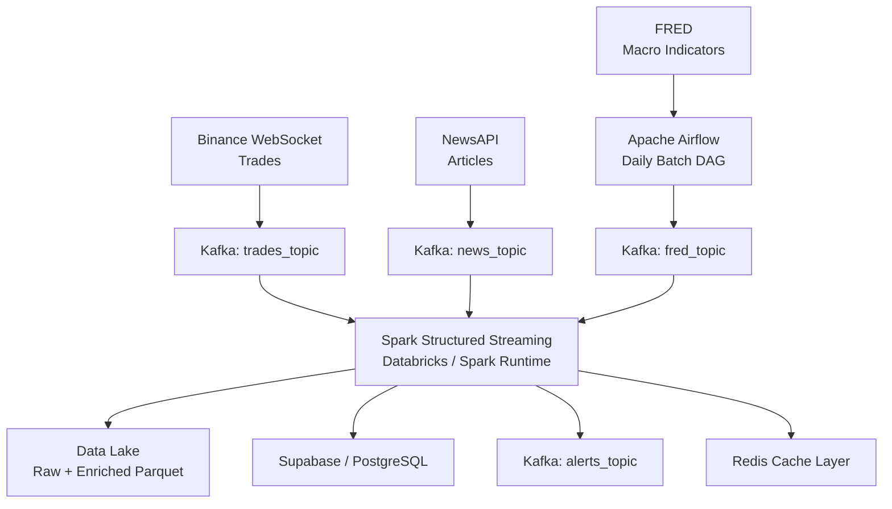

# CryptoPulse Intelligence Platform


**CryptoPulse Intelligence Platform** is an enterprise-grade real-time market intelligence pipeline for crypto analytics, risk monitoring, alerting, and downstream data products. It combines Binance trades, market news, and FRED macroeconomic indicators into a Kafka-centered streaming architecture. Spark Structured Streaming enriches the feeds, calculates market intelligence signals, and fans results out to a data lake, Supabase/PostgreSQL, Redis, and a Kafka alerts topic.


## Platform Overview

| Layer | Technology | Purpose |
| --- | --- | --- |
| 🟡 Market ingestion | Binance WebSocket | Real-time crypto trades |
| 📰 News ingestion | NewsAPI | Market headlines and article metadata |
| 🏦 Macro ingestion | FRED + Airflow | Scheduled macroeconomic indicators |
| 🔁 Event backbone | Confluent Cloud Kafka | Durable streaming topics |
| ⚡ Stream processing | Spark Structured Streaming | Windowing, joins, enrichment, sentiment, volatility |
| 🗄️ Storage | Data Lake + Supabase/PostgreSQL | Historical analytics and application queries |
| 🚨 Alerting | Kafka `alerts_topic` | Event-driven risk and signal notifications |
| ⚡ Serving cache | Redis | Low-latency latest market intelligence |

## ✨ Key Features

### 🔌 Multi-Source Ingestion

- Binance WebSocket trade stream for BTC, ETH, BNB, SOL, ADA, or any configured symbols
- NewsAPI polling producer for crypto and market articles
- FRED macroeconomic batch producer orchestrated by Apache Airflow
- Confluent Cloud Kafka topics aligned to the architecture diagram:
  - `trades_topic`
  - `news_topic`
  - `fred_topic`
  - `alerts_topic`

### 🧠 Streaming Intelligence Layer

- Spark Structured Streaming job for JSON parsing and schema enforcement
- Event-time watermarks for late data handling
- 1-minute trade windows for price, volume, count, and volatility metrics
- 5-minute news windows for sentiment and headline context
- FRED macro snapshot enrichment
- Alert generation for volatility or sentiment spikes

### 📤 Multi-Sink Fan-Out

- Data lake output in partitioned Parquet format
- Supabase/PostgreSQL JDBC writes for analytical querying
- Redis cache for latest per-symbol intelligence
- Kafka `alerts_topic` for downstream alert consumers

### 🛡️ Production Hygiene

- API keys and Kafka credentials are loaded from environment variables
- Shared Kafka configuration helper for producers
- `.gitignore` excludes generated caches, Airflow logs, and local secrets
- Docker requirements include Spark, Kafka, Redis, PostgreSQL, and producer dependencies

## 🏗️ Architecture

CryptoPulse follows the architecture in `Project archtecture.png`:




## 📁 File Structure

```text
Real-Time-Crypto-Intelligence-Pipeline-main/
|
|-- README.md
|-- Project archtecture.png
|-- fred_all_indicators.csv
|
|-- config/
|   `-- example.env                  # Environment variable template
|
|-- kafka/
|   |-- common.py                     # Shared Kafka producer configuration
|   |-- binance_kafka.py              # Binance WebSocket -> trades_topic
|   `-- news.py                       # NewsAPI polling -> news_topic
|
|-- airflow_project/
|   |-- docker-compose.yaml           # Local Airflow stack
|   |-- dags/
|   |   `-- fred_dag.py               # Daily FRED orchestration DAG
|   `-- scripts/
|       `-- fred_producer.py          # FRED API -> fred_topic
|
|-- spark/
|   `-- structured_streaming.py       # Kafka -> enrichment -> multi-sink fan-out
|
|-- docker/
|   |-- Dockerfile                    # Spark runtime image
|   `-- requirements.txt              # Python dependencies
|
`-- test-scripts/
    |-- binance_ws_test.py
    |-- fred_test.py
    `-- news_test.py
```

## ✅ Prerequisites

- Python 3.10+
- Docker and Docker Compose
- Confluent Cloud Kafka cluster
- NewsAPI key
- FRED API key
- Optional: Databricks workspace or another Spark runtime
- Optional: Supabase/PostgreSQL database
- Optional: Redis instance

## ⚙️ Configuration

Create a local `.env` file from the template:

```bash
cp config/example.env .env
```

Set the required values:

```bash
KAFKA_BOOTSTRAP_SERVERS=pkc-xxxxx.region.provider.confluent.cloud:9092
KAFKA_SASL_USERNAME=your_confluent_api_key
KAFKA_SASL_PASSWORD=your_confluent_api_secret
NEWS_API_KEY=your_newsapi_key
FRED_API_KEY=your_fred_api_key
```

Optional sink configuration:

```bash
DATA_LAKE_PATH=/mnt/crypto-intelligence/data-lake/enriched
SPARK_CHECKPOINT_PATH=/mnt/crypto-intelligence/checkpoints/main
SUPABASE_JDBC_URL=jdbc:postgresql://db.your-project.supabase.co:5432/postgres
SUPABASE_DB_USER=postgres
SUPABASE_DB_PASSWORD=your_database_password
REDIS_HOST=localhost
REDIS_PORT=6379
```

## 🛠️ Installation

Install local Python dependencies:

```bash
pip install -r docker/requirements.txt
```

For Spark, either use Databricks or build the provided Docker runtime:

```bash
docker build -t crypto-intelligence-spark -f docker/Dockerfile docker
```

## 🚀 Running the Platform

### 1. Start the Binance Trades Producer

```bash
python kafka/binance_kafka.py
```

This publishes normalized trade events to `trades_topic`.

### 2. Start the News Producer

```bash
python kafka/news.py
```

This polls NewsAPI every `NEWS_POLL_SECONDS` seconds and publishes article metadata to `news_topic`.

### 3. Start Airflow for FRED Batch Ingestion

```bash
cd airflow_project
cp ../.env .env
docker compose up airflow-init
docker compose up
```

Open Airflow at `http://localhost:8080`, enable `fred_batch_pipeline`, and run or wait for the daily schedule. The DAG executes `airflow_project/scripts/fred_producer.py` and publishes macro records to `fred_topic`.

### 4. Run Spark Structured Streaming

On a Spark runtime with Kafka and PostgreSQL drivers available:

```bash
spark-submit spark/structured_streaming.py
```

The job reads `trades_topic`, `news_topic`, and `fred_topic`, then writes enriched output to the configured sinks.

## 🔗 Integration Guide

CryptoPulse is designed to be integrated into dashboards, web apps, alerting systems, analytics platforms, and larger enterprise data pipelines.

### 🌐 Web App Integration

Use Supabase/PostgreSQL as the main query layer for historical and windowed analytics:

```sql
SELECT
  symbol,
  window_start,
  avg_price,
  volatility,
  sentiment_score,
  sample_headline
FROM crypto_market_intelligence
WHERE symbol = 'BTCUSDT'
ORDER BY window_start DESC
LIMIT 100;
```

Recommended web-app pattern:

- Use **Supabase/PostgreSQL** for charts, tables, historical views, and portfolio analytics.
- Use **Redis** for the latest market snapshot shown on live dashboards.
- Use **Kafka `alerts_topic`** for push notifications, trading alerts, or incident workflows.

Example Redis lookup for a backend API:

```python
import json
import redis

client = redis.Redis(host="localhost", port=6379, decode_responses=True)
latest = json.loads(client.get("crypto:intelligence:BTCUSDT:latest"))
```

### 📊 BI and Analytics Platform Integration

Connect BI tools directly to Supabase/PostgreSQL or the data lake output:

- **Power BI / Tableau / Metabase**: connect to PostgreSQL for enriched market intelligence tables.
- **Databricks / Spark SQL**: read the Parquet data lake for large-scale historical analysis.
- **dbt**: model `crypto_market_intelligence` into marts such as `market_risk_signals`, `asset_sentiment`, or `macro_enriched_prices`.

### 🚨 Alerting and Notification Integration

Consume `alerts_topic` from any Kafka-compatible service:

- Notification services: Slack, Discord, Telegram, email, SMS
- Trading infrastructure: risk engines, execution monitors, portfolio guards
- Incident tooling: PagerDuty, Opsgenie, custom webhooks

Basic consumer flow:

```text
alerts_topic -> alert consumer -> rules/router -> notification channel or risk service
```

### 🔁 Pipeline-to-Pipeline Integration

Use Kafka topics as stable contracts between CryptoPulse and other platforms:

- Downstream ML pipelines can consume `trades_topic`, `news_topic`, `fred_topic`, or `alerts_topic`.
- Feature stores can ingest enriched Spark outputs for model training.
- Lakehouse jobs can read the Parquet data lake and join it with portfolio, order-book, or exchange metadata.
- Enterprise schedulers can trigger the Airflow FRED DAG as part of a broader macro-data refresh workflow.

### 🧩 API Layer Integration

For production web apps, place a service API between the frontend and the sinks:

```text
Frontend Dashboard
    -> Backend API
        -> Redis for latest state
        -> PostgreSQL for historical windows
        -> Kafka alerts for event subscriptions
```

This keeps credentials away from the browser, centralizes authorization, and lets product teams expose clean endpoints such as:

- `GET /api/market/latest/BTCUSDT`
- `GET /api/market/history/BTCUSDT?window=1m`
- `GET /api/alerts/recent`
- `GET /api/macro/snapshot`

## 📜 Data Contracts

### `trades_topic`

```json
{
  "symbol": "BTCUSDT",
  "price": 65000.25,
  "quantity": 0.12,
  "trade_id": 123456789,
  "event_time": "2026-05-19T12:00:00+00:00",
  "ingestion_time": "2026-05-19T12:00:01+00:00",
  "source": "Binance"
}
```

### `news_topic`

```json
{
  "title": "Bitcoin rallies as market volatility rises",
  "description": "Market context from a supported source.",
  "url": "https://example.com/article",
  "source": "Reuters",
  "published_at": "2026-05-19T12:00:00Z",
  "ingestion_time": "2026-05-19T12:00:05+00:00"
}
```

### `fred_topic`

```json
{
  "series_id": "CPIAUCSL",
  "series_name": "Consumer Price Index",
  "date": "2026-04-01",
  "value": 320.1,
  "source": "FRED",
  "ingestion_time": "2026-05-19T12:05:00+00:00"
}
```

### Enriched Output

Spark creates rows with:

- `window_start`, `window_end`
- `symbol`
- `avg_price`, `min_price`, `max_price`
- `total_quantity`
- `trade_count`
- `volatility`
- `sentiment_score`
- `news_count`
- `sample_headline`
- `macro_snapshot`
- `batch_id`, `processed_at`

## 🚨 Alert Logic

Rows are sent to `alerts_topic` when either condition is true:

- `volatility >= 0.015`
- `abs(sentiment_score) >= 2.0`

The thresholds are intentionally simple and can be tuned in `spark/structured_streaming.py`.

## 🧪 Testing and Validation

Run syntax validation:

```bash
python -m py_compile kafka/common.py kafka/binance_kafka.py kafka/news.py airflow_project/scripts/fred_producer.py spark/structured_streaming.py
```

Use the source API smoke tests:

```bash
python test-scripts/binance_ws_test.py
python test-scripts/news_test.py
python test-scripts/fred_test.py
```

The smoke tests call external APIs and require network access plus valid API keys where applicable.

## 🧯 Troubleshooting

| Issue | Fix |
| --- | --- |
| Missing Kafka config | Confirm `KAFKA_BOOTSTRAP_SERVERS`, `KAFKA_SASL_USERNAME`, and `KAFKA_SASL_PASSWORD` are set |
| News producer fails immediately | Set `NEWS_API_KEY` and verify your NewsAPI plan supports the requested sources |
| FRED DAG fails | Set `FRED_API_KEY` inside the Airflow environment or `.env` consumed by Docker Compose |
| Spark cannot read Kafka | Ensure the Spark Kafka package is installed and Confluent credentials are correct |
| Supabase write fails | Verify `SUPABASE_JDBC_URL`, username, password, and PostgreSQL JDBC driver |
| Redis write fails | Verify Redis host, port, password, and network access from Spark executors |

## 🔐 Security Notes

- Do not commit real API keys, database passwords, or Confluent secrets.
- Use `config/example.env` as a template and keep real `.env` files local.
- Rotate any credentials that were previously committed before using the project with live services.

## 🗺️ Roadmap

- Add schema registry support for Kafka message contracts
- Replace simple keyword sentiment with a dedicated NLP model
- Add Great Expectations or Deequ checks for data quality
- Add dashboard examples for Supabase/PostgreSQL analytics
- Add CI validation for linting and unit tests
